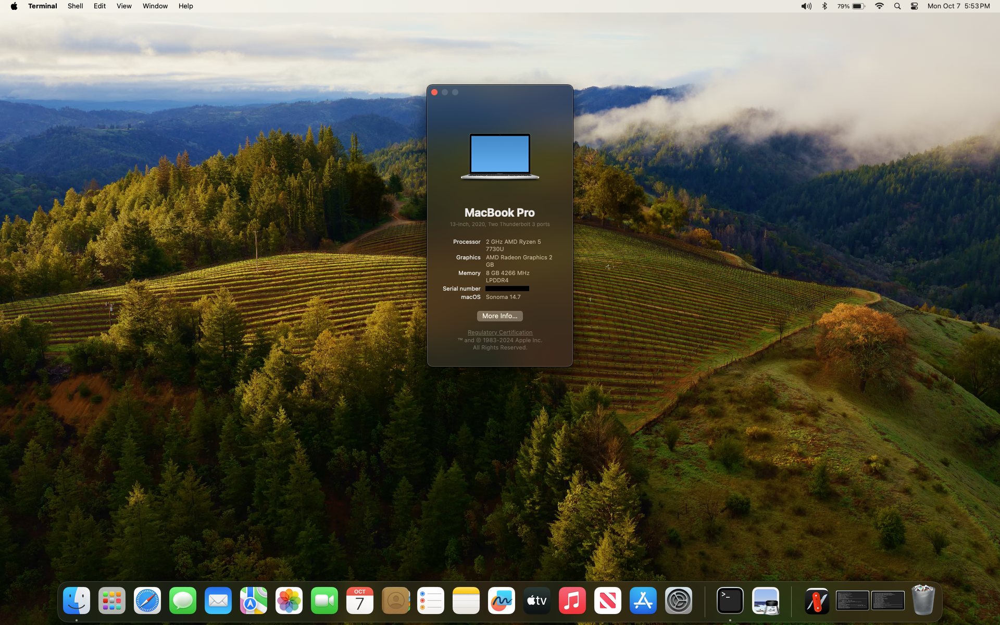

# [Lenovo Yoga 6 Gen 8 (13ABR8) Ryzentosh](https://psref.lenovo.com/syspool/Sys/PDF/Yoga/Yoga_6_13ABR8/Yoga_6_13ABR8_Spec.pdf)

## Intro

|          | Version              |
|----------|----------------------|
| OpenCore | 1.0.2                |
| macOS    | Sonoma 14.7 (23H124) |

I built my first hack back in 2009 on an Asus eeePC 1000HE netbook with OS X Snow Leopard. Since then I have hack'd a half dozen Intel based laptops and desktops. Lately I've been intrigued by the progress for AMD based systems, especially now that ChefKiss has released a driver for AMD Vega iGPU's. So one day I clicked on a Best Buy email link for open box/refurbished laptop deals. The specs on this Lenovo (2023 model) fit all of my Ryzentosh criteria, except for the 8 GB of RAM. I don't know why it was returned (I read several reviews about the poor WiFi performance of the Mediatek card), but it was in perfect shape aside of a few minor dings in the top of the lid. So for $255 USD, I took the chance. I was surprised at how smoothly the setup and install went. Then I hit a horrible snag, **THE TOUCHPAD DID NOT WORK!**
 
## Hardware

|              | Specification | macOS Compatibility |
| ------------ | -------------- | ------------------- |
| BIOS         | L5CN22WW       | See [BIOS Settings](#biosset) |
| CPU          | AMD Ryzen 5 7530U | [AMD Vanilla](https://github.com/AMD-OSX/AMD_Vanilla) patches for 6 core Zen 3 |
| iGPU         | AMD Radeon Barcelo, rev c5 (Vega 7) | NootedRed, BIOS UMA Buffer Size set to 2GB (default) |
| Chipset      | AMD Renoir/Cezanne |  |
| Screen       | 13.3" WUXGA (1920x1200 \| 16:10) Multi-Touch |  |
| Memory       | 8 GB DDR4 4266 MHz | Soldered, not upgradeable; **YUK!** |
| Storage      | WD_BLACK SN850X 1TB GEN4 (M.2 2280) | Native (NVMeFix not needed) |
| Camera + IR  | Bison Electronics Inc. Integrated FHD Camera | Native drivers for USB camera input |
| WiFi / Bluetooth | Intel(R) AX210 WiFi 6E / Bluetooth 5.3 | [OpenIntelWireless](https://github.com/OpenIntelWireless) Airportitlwm / IntelBluetoothFirmware |
| USB          | USB-A 3.2 Gen 1 x 2 + USB-C 3.2 Gen 1 x 2 | USB map provided, but not used |
| Ext. Monitor | via USB-C or HDMI 2.0 x 1 | Not tested |
| Audio        | Realtek ALC3287 | AppleALC - Realtek ALC257 codec (alcid=11) |
| Battery      | 59Wh Li-Polymer | ECEnabler / SMCBatteryManager / SSDT-EC |
| Keyboard     | PS2 | VoodooPS2Controller/VoodooPS2Keyboard |
| Touchpad     | Cirque 1080 I2C Precision Touchpad | VooDooI2C/VoodooI2CHID [fix](#cirq1080) |
| Touchscreen  | Wacom WACF2200 I2C Multi-Touch | VooDooI2C/VoodooI2CHID |
| Fingerprint Sensor | Shenzehn Goodix Technology Co.,Ltd. | Not Supported |
| SD/MMC Card Reader | O2 Micro, Inc. | Not Supported |

## Info
- SMBIOS: `MacBookPro16,3`
- EFI supports Big Sur through Sonoma and is ready for Sequoia; except, AirportItlwm

## Notes
- The stock Mediatek MT7921 Wi-Fi and Bluetooth DOES NOT work. I replaced mine with an Intel AX210 ($13 on Amazon). Easy swap once you get the case opened.
- I took advantage of opening the case and upgraded the stock Samsung PM981 256GB NVMe M.2 2242 SSD to the WD Black SN850X 1TB M.2 2280 SSD. The specification implies that the storage slot is M.2 2242 but it is really M.2 2280. The Samsung 2242 SSD has an adapter carrier to mount it in the 2280 sized slot.
- I had SSDTTIme build SSDT-USB-Reset; however, I found no benefit with using it.
- I use SSDT-SBUS-MCHC for completeness even though it does not appear to be neccessary.

## BIOS Settings
###Enable Advanced BIOS settings menu [per this link Answer](https://superuser.com/questions/1775335/how-to-access-advanced-setup-bios-uefi-on-lenovo-ideapad-5-pro)
- Start machine. Press &laquo;F2&raquo; during post (before screen turns on dim) to enter normal BIOS
- In normal BIOS go to Configuration and change 
&nbsp;&nbsp;&nbsp;&nbsp;HotKey Mode --> Disabled 
&nbsp;&nbsp;&nbsp;&nbsp;One Key Battery --> Disabled
- Exit BIOS saving changes.  
Now you can use the following "easter egg" key sequence at power on to gain access to the advanced settings. 
&nbsp;&nbsp;&nbsp;&nbsp;- Press and hold &laquo;Fn&raquo;+&laquo;R&raquo;+&laquo;N&raquo; 
&nbsp;&nbsp;&nbsp;&nbsp;- While still holding all above keys, press the &laquo;Power&raquo; button 
&nbsp;&nbsp;&nbsp;&nbsp;- Quickly release all keys with the power button release 
&nbsp;&nbsp;&nbsp;&nbsp;- Quickly press &laquo;F2&raquo; during post 
Go play TWISTER!!!

###Required BIOS Changes
- Security | Secure Boot --> Disabled
- AMD PBS | S3/Modern Standby Support --> S3 Enable [ref](https://saveriomiroddi.github.io/Enabling-the-S3-sleep-suspend-on-the-Lenovo-Yoga-7-AMD-Gen-7-and-possibly-others/) 
&nbsp;&nbsp;&nbsp;&nbsp;*I chose to enable S3 in BIOS rather than use SSDT patching as I run Linux too.*
- Exit - Exit Saving Changes

###Optional BIOS Changes
- Configuration | BIOS Back Flash --> Enabled
- Configuration | Flip To Start --> Disabled

## Kexts Used

| Kext | Version | Description |
| --- | --- | --- |
| [AdvancedMap](https://github.com/notjosh/AdvancedMap) |  1.0.0 2.0.0 3.0.0 4.0.0 | Enables modern maps on non-Apple Silicon hardware Monterey Ventura Sonoma Sequoia |
| [AirportItlwm](https://github.com/OpenIntelWireless) | 2.3.0 (stable) | Adds Intel WIFI support (EFI includes Kexts for Big Sur thru Sonoma) |
| [AppleALC](https://github.com/acidanthera/AppleALC) | 1.9.2 | Native macOS HD audio for not officially supported codecs |
| [AppleMCEReporterDisabler](https://dortania.github.io/OpenCore-Install-Guide/ktext.html#extras) | 1.0 | Disables AppleIntelMCEReporter which causes panics on AMD CPUs |
| [BlueToolFixup](https://github.com/acidanthera/BrcmPatchRAM) | 2.6.9 | Patches Bluetooth stack to allow non-Apple Bluetooth (included in BrcmPatchRAM)|
| [BrightnessKeys](https://github.com/acidanthera/BrightnessKeys) | 1.0.3 | Handler for brightness keys without DSDT patches |
| [DebugEnhancer](https://github.com/acidanthera/DebugEnhancer) | 1.1.0 | Enables debug output in the macOS kernel |
| [ECEnabler](https://github.com/1Revenger1/ECEnabler) | 1.0.5 | Necessary for laptop battery status to work properly |
| [ForgedInvariant](https://github.com/ChefKissInc/ForgedInvariant) | Nightly Pre-Release (2024-08-29) 1.0.0-RELEASE | Synchronises the TimeStamp Counter (TSC), necessary for laptop APUs |
| [IntelBluetooth](https://github.com/OpenIntelWireless/IntelBluetoothFirmware) &nbsp;&nbsp;&nbsp;&nbsp;IntelBluetoothFirmware &nbsp;&nbsp;&nbsp;&nbsp;IntelBluetoothInjector &nbsp;&nbsp;&nbsp;&nbsp;IntelBTPatcher | 2.4.0 | Intel Bluetooth Kernel Extensions for macOS |
| [Lilu](https://github.com/acidanthera/Lilu) | 1.6.9 | Arbitrary kext and process patching on macOS |
| [NootedRed](https://github.com/ChefKissInc/NootedRed) | Nightly Pre-Release (2024-09-21) 1.0.0-RELEASE | Provides graphical acceleration for AMD Vega iGPUs |
| [RealtekRTL8111](https://github.com/Mieze/RTL8111_driver_for_OS_X) | 2.4.2 | Open source driver for the Realtek RTL8111/8168 family |
| [RestrictEvents](https://github.com/acidanthera/RestrictEvents) | 1.1.5 | Fixes CPU name in About This Mac, allows forcing VMM to fix OTA updates on T2 SMBIOSes on macOS Sonoma+ |
| [SMCProcessorAMD](https://github.com/Lorys89/SMCProcessorAMD) | 1.0.1 | VirtualSMC plug-in for AMD CPU temperature |
| [SMCRadeonSensors](https://github.com/ChefKissInc/SMCRadeonSensors) | 2.3.0 | VirtualSMC plug-in that provides temperature readings for AMD GPUs |
| [USBToolBox](https://github.com/USBToolBox/kext) [currently disabled] | 1.1.1 | Make common actions for USB mapping easier |
| [UTBMap](https://github.com/USBToolBox/tool) [currently disabled] | 0.2 | USB Map created with the USBToolbox tool on Windows 11 |
| [VirtualSMC](https://github.com/acidanthera/VirtualSMC)  &nbsp;&nbsp;&nbsp;&nbsp;VirtualSMC &nbsp;&nbsp;&nbsp;&nbsp;SMCBatteryManager &nbsp;&nbsp;&nbsp;&nbsp;SMCLightSensor | 1.3.4 | Advanced Apple SMC emulator in the kernel Emulates Apple’s SMC VirtualSMC plug-in that monitors laptop battery status VirtualSMC plug-in that adds support for ACPI Ambient Light Sensor (required for functioning backlight) |
| [VoodooPS2](https://github.com/acidanthera/VoodooPS2)  &nbsp;&nbsp;&nbsp;&nbsp;VoodooPS2Controller &nbsp;&nbsp;&nbsp;&nbsp;VoodooPS2Keyboard | 2.3.6 | PS/2 device driver package PS/2 port controller Plug-in driver for PS/2 keyboard input |
| [VoodooI2C](https://nootinc.github.io/Extras/Kexts/VoodooI2C.zip)  &nbsp;&nbsp;&nbsp;&nbsp;VoodooI2C &nbsp;&nbsp;&nbsp;&nbsp;VoodooGPIO &nbsp;&nbsp;&nbsp;&nbsp;VoodooI2CServices &nbsp;&nbsp;&nbsp;&nbsp;VoodooU2CHID | [Custom](#cirq1080) | Drivers for I2C bus devices I2C controller drivers GPIO controller driver Core services Drivers for HID inputs |

## SSDTs Used

| Table | Description |
| --- | --- |
| [SSDT-ALS0](https://github.com/Acidanthera/OpenCorePkg/blob/master/Docs/AcpiSamples/Source/SSDT-ALS0.dsl) | Provides Ambient Light Sensor presence required for functional backlight |
| SSDT-EC* | Adds a fake Embedded Controller device |
| SSDT-HPET* | resolve HPET device IRQ conflicts with PIC, RTC and TMR |
| SSDT-I2CC-ECSH | Disables 3rd I2C digitizer pen device (see [Touchpad Fix](#cirq1080)) |
| SSDT-PLUG-ALT* | Fixes CPU definitions |
| SSDT-PNLF* | Adds PNLF device for backlight control |
| [SSDT-SBUS-MCHC](https://github.com/acidanthera/OpenCorePkg/blob/master/Docs/AcpiSamples/Source/SSDT-SBUS-MCHC.dsl) | SMBus compatibility table |
| SSDT-USBX* | Enables USB Power Management || [SSDT-XOSI](https://github.com/corpnewt/SSDTTime) | Spoof macOS to Windows for some ACPI features |
| SSDT-XOSI* | Spoof Windows (I still don't understand how this works!) |

\*Done with [SSDTTime](https://github.com/corpnewt/SSDTTime) in Windows 11

## Working
- WiFi
- Bluetooth
- Sound
- Graphics Acceleration
- Keyboard
- Touchpad [fix](#cirq1080)
- Touchscreen
- Battery Status/Settings
- Webcam / Microphone
- USB-A/C
- Brightness Keys
- Sleep
- Wake (power button and keyboard)

### Not Working
- DRM
- FingerPrint Reader
- Wake from sleep with lid open, touchpad, touchscreen or mouse inputs 
&nbsp;&nbsp;&nbsp;&nbsp;- behavior is same on Linux 
&nbsp;&nbsp;&nbsp;&nbsp;- Possibly investigate [OC-Little AOAC](https://github.com/5T33Z0/OC-Little-Translated/tree/main/04_Fixing_Sleep_and_Wake_Issues/Fixing_AOAC_Machines) patches 
&nbsp;&nbsp;&nbsp;&nbsp;- I don't remember Windows behavior (OS no longer installed)

### Not Tested
- Headphone / Microphone combo jack
- HDMI
- USB-C Display port
- SD/MMC Card Reader
- iServices
- Webcam IR

## Touchpad Fix
This could have been the easiest, highly functional hack I've ever built if not for the touchpad. I spent two months getting the touchpad to work. I would have given up after two weeks but this laptop is really impressive running macOS.  
At first I was skeptical that my hardware was too new for the AMD I2C implementation (contributed by [ChefKiss](https://nootinc.github.io/Extras/Kexts/VoodooI2C.zip)). I ruled this out because
 1) All of the VoodooI2C drivers were attaching to the touchpad device;
 2) The touchpad worked in Mouse mode; and
 3) The other I2C device (touchscreen) worked.
I only found one other request for help with the same manufacturer and model touchpad (Cirque 1080 [0488:1080]). That was on the VoodooI2C Gitter chat room, and without resolution. After researching and learning more about HID protocol, I realized that I was going to have to dive in to the VoodooI2C driver source code. With the aid of Linux and hid-tools, I could see that VoodooI2C was communicating with the device as the HID Report Descriptor was correct (as compared to Linux). Definitely time to dig in and debug the [code](https://github.com/VoodooI2C/VoodooI2C/tree/2.9). **NOTE:** *At this point in time the VoodooI2C team had already merged the ChefKiss AMD changes in preparation for the 2.9 release.*  
Well, this **1OldSWguy** with 22 years experience writing control sw for the automotive industry, fluent in C programming, got totally tripped up in C++ and Xcode. [Sidebar, Xcode would not run on this laptop. I think Xcode 15 may require 16GB RAM.] But, I eventually waded my way to the correct algorithm to instrument the code for exraction of the raw data coming from the touchpad. This revealed that the touchpad was sending the mouse input report. OK, on to investigate why the request to enter touchpad mode was failing.  
Finally, something was simple to find. The input mode request function name stood out like a sore thumb, *enterPrecisionTouchpadMode*. I then noticed that this request function was sending one extra byte compared to the device report descriptor. The next course of action was a gamble as I could not recall what the HID spec said about extra data in a feature report. From my experience with hardware drivers, I guessed that the touchpad device was rejecting the request (with or without response, I do not know). So I removed the extra byte, and **BINGO**, the touchpad worked, with all gestures to boot!  
I informed the VoodooI2C team about my findings and was asked to submit a pull request for review. I noticed that the VoodooI2C 2.9 branch was not pulling in a change (pull request [#71](https://github.com/VoodooI2C/VoodooI2CHID/pull/71)) from the main branch of the VoodooI2CHID satellite. The developer of that change, 1Revenger1, asked me to test it, so I did. It worked too.  All throughout my touchpad debugging venture, I had the 3rd I2C device disabled (in BIOS). This is because I was worried that VoodooI2CHID attaching to a non-existing piece of hardware might interfere with debugging the touchpad. With the touchpad now fixed, I decided to re-enable it. This somehow created an interaction with the 3rd I2C device (digitizer pen) when I booted with a USB mouse connected. Since I don't have the digitizer pen, I disable the 3rd I2C device (using SSDT + ACPI rename patches) when running macOS. I'm still evaluating which method to stay with.  <u>**So you'll need to use one of my custom VoodooI2C kexts if you have this Cirque 1080 touchpad.**</u> 
&nbsp;&nbsp;&nbsp;&nbsp;[2.9 branch + My Fix](./Resources/VoodooI2C/VoodooI2C-2.9.Fix1.zip) - 2.9 branch with fix to remove extra byte in input mode request 
&nbsp;&nbsp;&nbsp;&nbsp;[2.9 branch + PR #71](./Resources/VoodooI2C/VoodooI2C-2.9.pr71.zip) - 2.9 branch with referenced pull request 

## Thanks to:
- [1Revenger1](https://github.com/1Revenger1) - for suggesting to pull in *enterPrecisionTouchpadMode* changes from the VoodooI2CHID main branch (pending release)
- [acidanthera](https://github.com/acidanthera) - for OpenCore and numerous kexts, making Hackintosh possible in the first place
- [AMD-OSX](https://github.com/AMD-OSX/AMD_Vanilla) - for AMD Vanilla patches, making this Ryzentosh possible
- [ChefKiss](https://chefkissinc.github.io/guides/hackintosh/) - for awesome AMD guide, NootedRed, and adding AMD support to VoodooI2C
- [dortania people](https://github.com/orgs/dortania/people) for the OpenCore Install Guide
